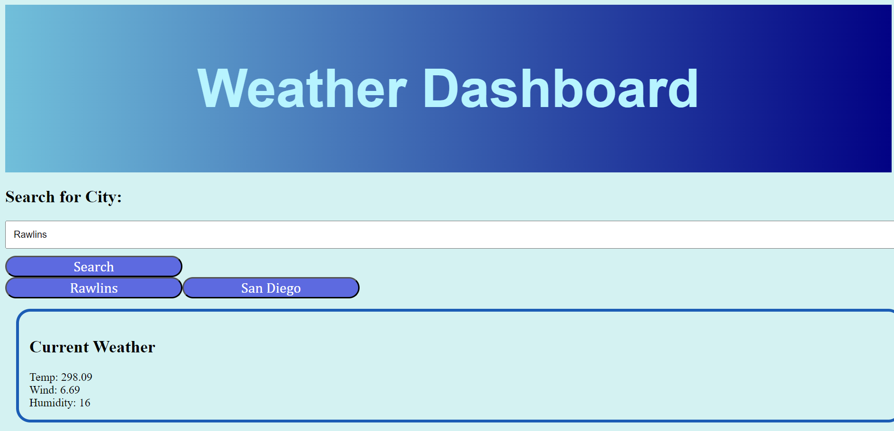
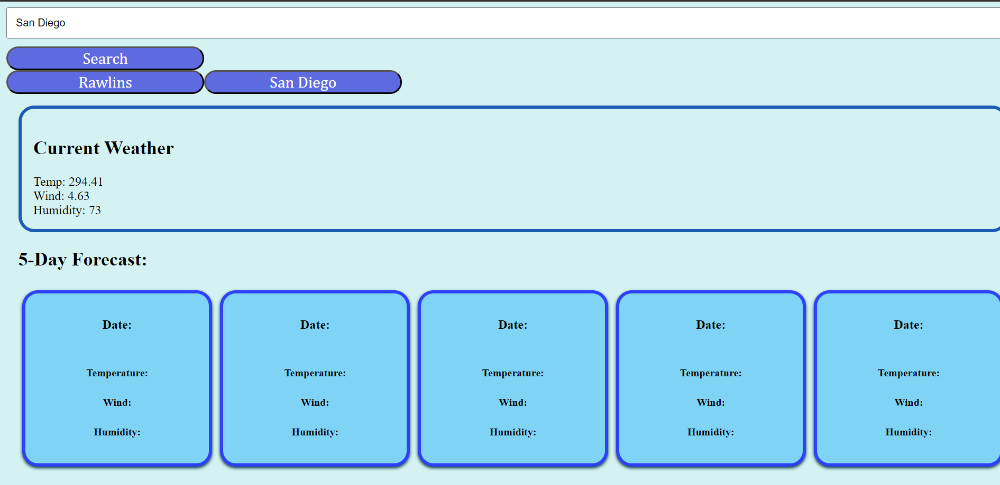

# Weather-app
A weather dashboard application that allows users to sear for the current weather conditions and saves the search history as a button for quick access.

## How to Use
Search for a city name in he search box and click search. The dashboard will display the current weather conditions including temperature, wind speeds, and humidity. The application saved the search history as a button so you can click on it to quickly view the current weather of that city.

## Installation 
Clone the repository and open the html in your web browser. Replace the api with your own API key. 

## Known Issues
The 5-day forecast is not functioning as expected and has been disabled. The application only displays the current weather conditions and search history.

## Images

## License
None.